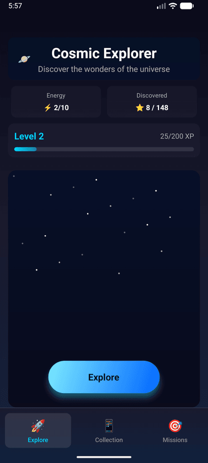
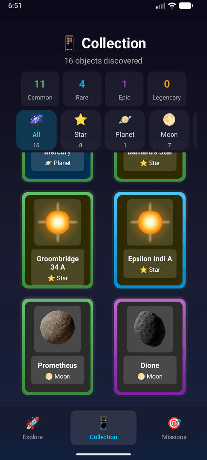
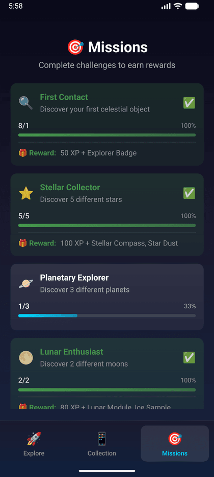
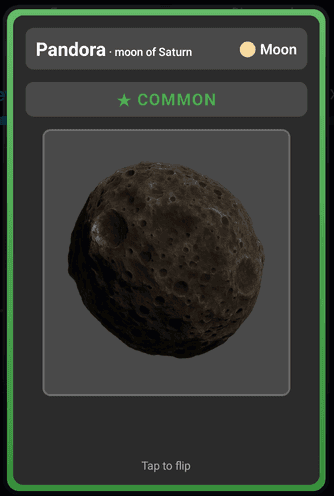
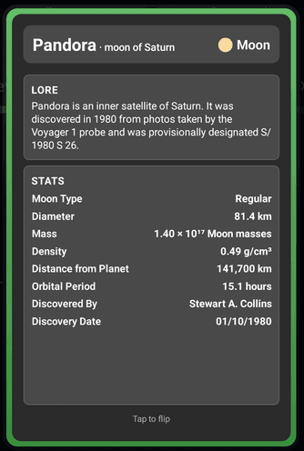

# 🌌 Cosmic Collector

A React Native (Expo) collectible-card game built on **real astronomical data**. Explore the universe, discover celestial objects, and complete your collection — every card is a real body with real measurements, pulled from live APIs rather than hardcoded.

**Catalog: 148 objects** — 8 planets and 60 moons from the [Solar System OpenData API](https://api.le-systeme-solaire.net/), plus 80 stars from a dataset compiled from Wikipedia.

| Explore | Collection | Missions |
|:--:|:--:|:--:|
|  |  |  |

## Screens

| Screen | What it does |
|---|---|
| **Explore** | Spend energy to discover a random object, weighted by rarity. Animated card reveal with particle effects on rare finds. |
| **Collection** | Grid of everything discovered, filterable by type and rarity, with completion stats. |
| **Missions** | Nine achievements tracking discoveries, types collected and level milestones. |

Cards flip to reveal the object's real scientific data — mass, radius, gravity, orbital period, surface temperature, spectral class, distance — alongside a description and themed loot.

| Card front | Card back |
|:--:|:--:|
|  |  |

## Architecture

The data layer is built in four stages, so that adding a new object type means adding a provider and a mapper rather than editing existing code:

```
API clients      →  providers        →  mappers          →  catalog service  →  Zustand stores
(HTTP only)         (fetch + cache)     (API → domain)      (orchestration)     (UI state)

SolarSystemClient   PlanetProvider      mapPlanet          CatalogService      playerStore
WikipediaClient     MoonProvider        mapMoon                                collectionStore
                    StarProvider        mapExtractedStar                       inventoryStore
```

Notable pieces:

- **Server-side filtering.** `SolarSystemClient.getMoons()` asks the API for exactly the moons it needs — multiple `filter[]` parameters with `satisfy=any` — then dedupes and returns the top 60 by mean radius, instead of downloading every body and filtering on the device.
- **Dependency-ordered loading.** `CatalogService` loads planets first, then fans out to moons (which need planet IDs) and stars in parallel.
- **24-hour AsyncStorage cache** per object type, so the app is usable offline after first launch.
- **Descriptions** are fetched from the Wikipedia REST API and merged into objects at map time.
- **Star pipeline.** `scripts/extractStars.js` compiles a source spreadsheet into `src/data/stars.json`; `mapExtractedStar` parses its unit-bearing string values ("25.3 ± 5.3 M☉", "2.2 - 3.56 Myr") into typed numbers.

## Tech stack

React Native 0.81 · Expo 54 · React 19 · TypeScript 5.9 · Zustand 5 · AsyncStorage · Expo Linear Gradient · React Native Animated

## Getting started

**Prerequisites:** Node.js 18+, and an Android/iOS emulator or the Expo Go app.

```bash
git clone https://github.com/Chnmtl/CosmicCollector.git
cd CosmicCollector
npm install

# The Solar System API requires a bearer token (free, but mandatory).
# Generate one at https://api.le-systeme-solaire.net/generatekey.html
cp .env.example .env      # then paste your key into .env

npm run android   # or: npm run ios / npm run web
```

> `EXPO_PUBLIC_*` variables are inlined at bundle time — restart the dev server after changing `.env`.

## Project structure

```
src/
├── api/clients/      SolarSystemClient, WikipediaClient  — HTTP only
├── models/           Domain types: CosmicObject, Planet, Moon, Star
├── services/
│   ├── providers/    Fetch + cache per object type
│   ├── mappers/      API response → domain model (pure functions)
│   ├── CatalogService.ts
│   └── cacheService.ts
├── store/            Zustand: player, collection, inventory
├── components/       Cards (flip, front, back, compact), filters, tab bar
├── screens/          Explore, Collection, Missions
├── data/             Star dataset + mission and game-balance data
└── utils/            Constants, formatters, image resolver, stats
scripts/extractStars.js   Spreadsheet → stars.json
```

## Artwork

Moon card art by **[Ege Gülsoy (@fautzin)](https://github.com/fautzin)**, used with permission. Objects without dedicated art use a default image for their type.

`src/utils/imageResolver.ts` handles the lookup. Metro requires literal `require` paths, so the artwork maps are static.

## Roadmap

- Expanded card artwork
- Additional object types: galaxies, nebulae, exoplanets and black holes
- Sound effects and daily challenges

## License

**Proprietary — all rights reserved.** This repository is public so the code can be read and reviewed, not so it can be reused. Viewing for evaluation is fine; using, copying, modifying, redistributing or running it as a service is not, without prior written permission. See [LICENSE](LICENSE).

The card artwork is separately the copyright of Ege Gülsoy and is not covered by any grant here. Astronomical data belongs to its sources ([Solar System OpenData](https://api.le-systeme-solaire.net/), Wikipedia) and is used as factual reference.

## Credits

- **Cihan Mutlu** — [github.com/Chnmtl](https://github.com/Chnmtl) — code and design
- **Ege Gülsoy** — [github.com/fautzin](https://github.com/fautzin) — card artwork
